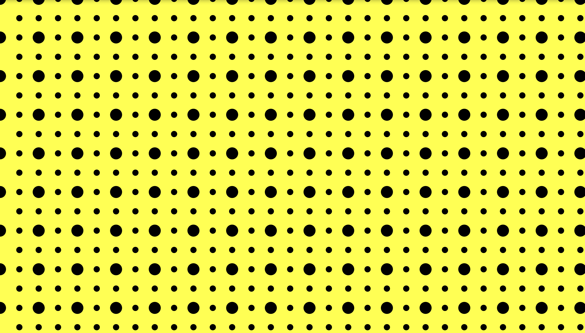

# p5.js Template

# 1st set of circles
For starters, I want to create 2 sets of circles given the circles' different sizes.
I began trying to write the first for loop. 

The first set of circles look good.
Image on repo:  

I adjusted the maxDiam to make the circles move closer. 

# 2nd set of circles
Given the smaller circles seem to share the in-between distance with the larger ones, I decided to keep the parameters.

Well, I would say there's a problem. I need to get the y correct. 
Image on repo:  


Oh, I did the original ypos for 50 but there is no need. 
Also, the distance between the big circle & a small one should equal the small one's original diameter. 

After adjustments and sketching, I got:
Image on repo:  



# Adjustments
Given the difference now is the lack of larger dots in every two horizontal lines, I decide to cover up the smaller dots.


This is a README file that can be used to describe and document your assignment.

Markdown Cheatsheet (from [https://www.markdownguide.org/cheat-sheet/](https://www.markdownguide.org/cheat-sheet/)):

---
---

# Heading1
## Heading2
### Heading3
#### Heading4
##### Heading5
###### Heading6

**bold text**

*italicized text*

~~strikethrough text~~

Ordered List:
1. First item
2. Second item
3. Third item

Unordered List:
- First item
- Second item
- Third item

`short code block`

```
extended code block
fun() {
  return 0
}
```

Link:  
[linked text](https://www.example.com)


Image with url:  


Image on repo:  


To start a new line, add two spaces at the end of a line, like this:  
this is a new line.


To start a new paragraph, leave an empty line between two lines of text.

This is a new paragraph.
